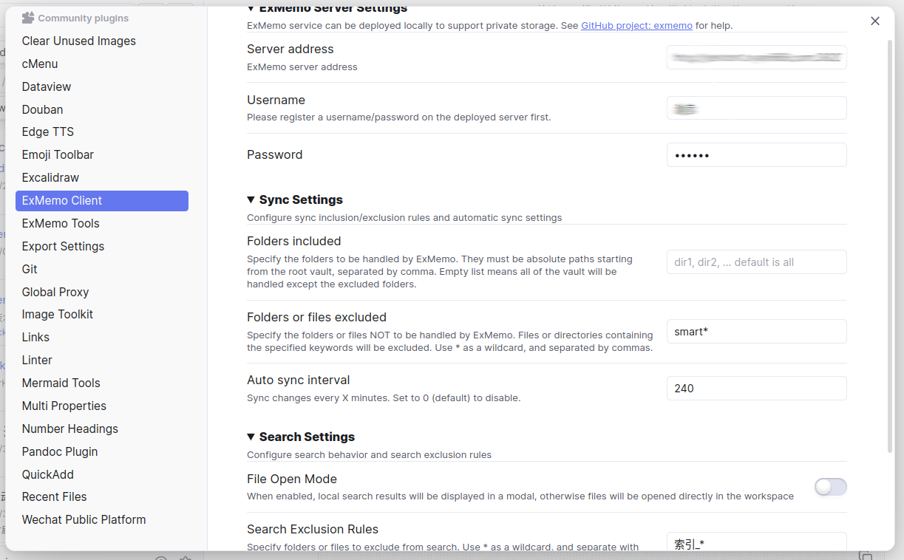
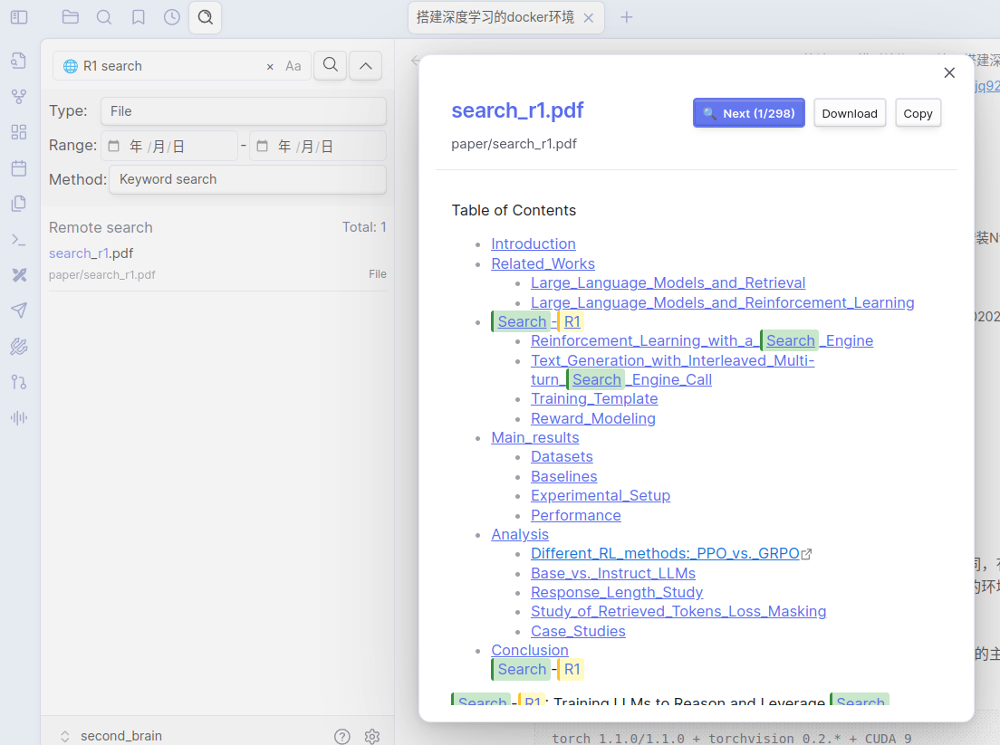

English | [中文简体](./README_cn.md)

## 1 Main Features

### 1.1 Intelligent Search

* **Local Search**: Quickly search local Obsidian notes in the sidebar
* **Remote Search**: Search notes, web bookmarks, quick notes, and other content on ExMemo server
* **Preview Feature**: Support remote file preview to view content before insertion

### 1.2 Note Synchronization

* Sync local Obsidian notes to ExMemo server for multi-device data consistency
* Support single file or batch file upload and download

## 2 Installation

### 2.1 Install obsidian-exmemo-client

Search for "exmemo" in the community plugin market and install the plugin, or download the latest version from GitHub Release page for manual installation.

### 2.2 Install ExMemo Server

(Not required if only using local search functionality)

Installation instructions: https://github.com/exmemo-ai/exmemo

## 3 Usage

### 3.1 Settings

(Not required if only using local search functionality)

- Server address format: http://IP:PORT, setup ExMemo backend service before use
- Register a user on ExMemo frontend before first use

### 3.2 Basic Operations

- Press Ctrl+P to bring up the plugin, enter ExMemo in the search box, and select the desired function.
- It's recommended to open the search interface in the left sidebar, corresponding to the "Search (Sidebar)" option.

### 3.3 Search Data

The plugin provides powerful search functionality, supporting unified search of local Obsidian notes and remote ExMemo data.

#### Search Types
* **Keyword Search**: Enter single or multiple keywords (space-separated) for matching
* **Filename Search**: Quickly locate target files by filename
* **Tag Search**: Filter relevant content through tag labels
* **Fuzzy Search**: Support fuzzy matching to improve search hit rate
* **Vector Search** (Remote): Enter complete sentences for semantic search without keyword splitting

#### Search Settings
* **Case Sensitive**: Choose whether to distinguish case
* **Time Range**: Set start and end range for file creation time
* **Directory Management**: Specify target search directories and exclude directories
* **Result Preview**: Remote search supports file preview to view content before insertion

#### Search Priority
Search results are sorted by the following priority:
* **Title Match** > **Content Match** > **Fuzzy Match**
* **Keyword Frequency**: Higher frequency results rank higher
* **Time Priority**: Sort by file time

### 3.4 Sync Notes

* Sync current note
* Upload or download all notes to/from ExMemo server

### 3.5 Attention

Before using "Sync All Files" for the first time, please back up your Obsidian data to prevent unexpected situations.

## 4 Background

ExMemo is a personal knowledge management system that helps users uniformly manage documents, web pages, quick notes, and various other information through AI technology for intelligent retrieval and correlation analysis.

The system adopts a distributed architecture and supports local deployment to protect privacy. The backend integrates mainstream large models such as OpenAI, Gemini, Qwen, and Ollama offline models, providing various frontend interfaces including web services, WeChat bots, Obsidian plugins, and browser extensions.

`obsidian-exmemo-client` is an Obsidian plugin for ExMemo, providing note synchronization and intelligent retrieval features.

## 5 License

This project is licensed under GNU Lesser General Public License v3.0. For details, please refer to [LICENSE](./LICENSE) file.

