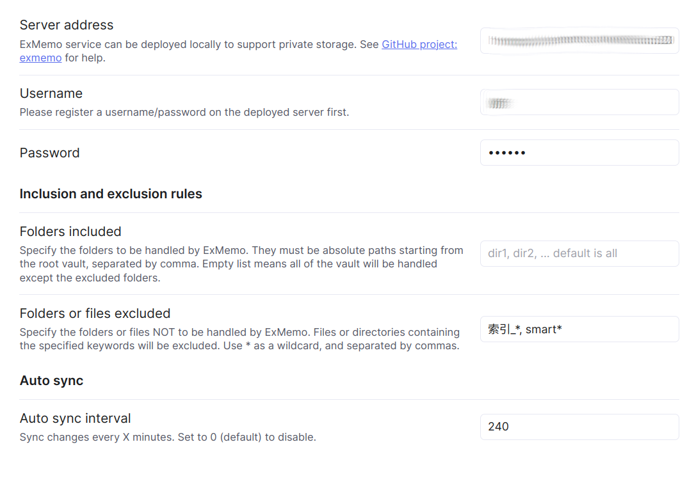

## 1 介绍


ExMemo 是一个个人知识管理项目，旨在集中记录和管理各种信息，包括喜欢的文字、书籍、音乐、视频、网页、工作文档，以及对生活的感受和思考。通过系统化整合，突破思维的局限，寻找内在关联。


系统由数据库、后端和多个前端组成。分布式存储和数据库用于保存用户文件、文本及对应的向量数据。数据存储可本地部署，从而保护用户隐私。后端提供通用接口对数据进行增删改查，并负责调用大模型和处理数据。系统支持 OpenAI、Gemini、Qwen 等主流在线大模型及 Ollama 离线模型。多个前端以 Web 服务、微信机器人、Obsidian 插件和浏览器插件等形式供用户上传和下载数据。

`obsidian-exmemo-client` 是 ExMemo 的一个客户端，是用于同步和检索的 Obsidian 插件。

## 2 主要功能

* 使用 ExMemo 同步不同设备上的 Obsidian 笔记，并存储在后端。
* 检索通过各个终端同步到 ExMemo 中的用户数据。
* 将 ExMemo 中的网页和随手记等内容整合到 Obsidian 笔记中。

## 3 使用方法

### 3.1 安装 ExMemo 服务端

安装方法见：https://github.com/exmemo-ai/exmemo

### 3.2 安装 obsidian-exmemo-client

#### 3.2.1 方法一：社区插件市场安装

在社区插件市场搜索 exmemo 关键字并安装插件

#### 3.2.2 方法二：下载源码编译安装

（主要用于需要修改源代码的情况）

**下载编译**

```bash
cd /exports/exmemo/code
git clone https://github.com/exmemo-ai/obsidian-exmemo-client.git
docker run --name obdev --rm -v /exports:/exports -it node:18 sh
cd /exports/exmemo/code/obsidian-exmemo-client
npm install
npm run build # build to main.js
```

也可以直接在 github 的 Release 界面下载最新版本插件。

**安装**

* 将编译后的 `main.js`、`manifest.json` 和 `styles.css` 复制到 Obsidian 仓库 的.obsidian/plugins/obsidian-exmemo-client/ 目录下。
* Obsidian 打开「设置」->「第三方插件」
* 找到「ExMemo」点击启动按钮

### 3.3 设置



- 服务器地址格式：http://IP:PORT，使用前请先搭建 ExMemo 后台服务。
- 第一次使用前需要在 ExMemo 前端注册用户。
- 按提示格式修改包含/排除目录或文件，以及定时同步时间。

## 4 使用

按 Ctrl+P 调出插件，在检索框中输入 ExMemo，然后选择所需的 ob 插件功能。

### 4.1 同步笔记

* 同步当前笔记
* 将所有笔记上传或下载至 ExMemo 服务器

### 4.2 搜索数据

* 通过输入关键字，可以匹配笔记、收藏网页或随手记录的内容，并将结果插入到当前笔记中。
* 如需匹配多个关键字，请使用空格分隔。
* 匹配优先级为：标题匹配 > 内容匹配 > 模糊匹配。
* 可以通过设置起止时间和条目数过滤搜索数据。

### 4.3 注意

在首次使用“同步所有文件”之前，请先备份你的 Obsidian 数据，以防意外情况发生。

## 5 License

本项目根据 GNU Lesser General Public License v3.0 授权。详情请参阅 [LICENSE](./LICENSE) 文件。

[](https://buymeacoffee.com/xieyan0811y)
