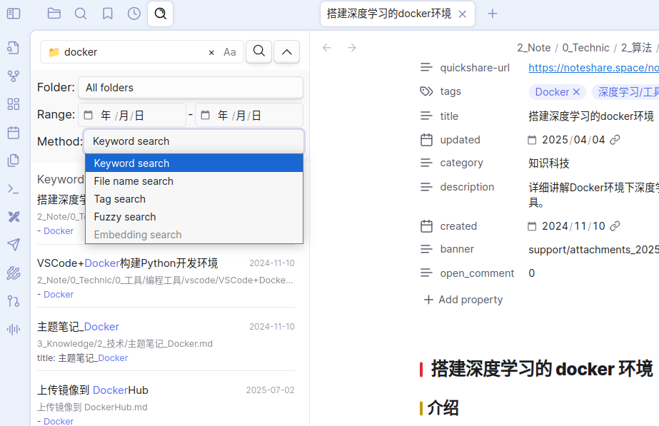
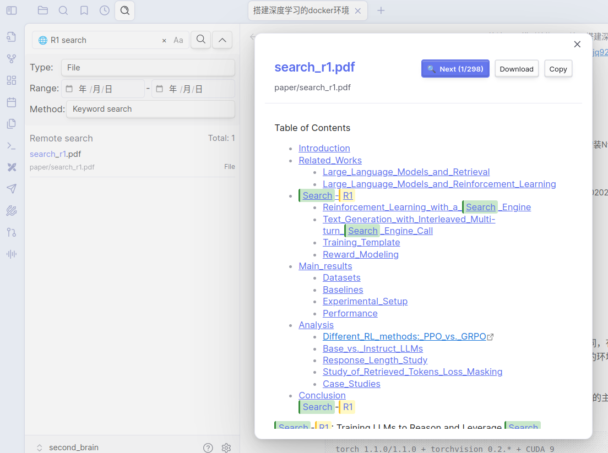

## 1 介绍

ExMemo 是一个个人知识管理系统，帮助用户统一管理文档、网页、随手记等各类信息，并在首次使用"同步所有文件"前，请先备份 Obsidian 数据，以防意外情况。过 AI 技术实现智能检索和关联分析。

系统采用分布式架构，支持本地部署以保护隐私。后端集成 OpenAI、Gemini、Qwen 等主流大模型及 Ollama 离线模型，提供 Web 服务、微信机器人、Obsidian 插件和浏览器插件等多种前端接口。

`obsidian-exmemo-client` 是 ExMemo 的 Obsidian 插件，提供笔记同步和智能检索功能。

## 2 主要功能

### 2.1 笔记同步
* 同步本地 Obsidian 笔记到 ExMemo 服务器，实现多设备数据一致性
* 支持单个文件或批量文件的上传下载

### 2.2 智能搜索
* **本地搜索**：在左侧边栏快速搜索本地 Obsidian 笔记
* **远程搜索**：搜索 ExMemo 服务器上的笔记、网页收藏、随手记等内容
* **预览功能**：支持远程文件预览，插入前可查看内容

## 3 安装方法

### 3.1 安装 ExMemo 服务端

安装方法见：https://github.com/exmemo-ai/exmemo

### 3.2 安装 obsidian-exmemo-client

在社区插件市场搜索 exmemo 关键字并安装插件，或在 GitHub Release 页面下载最新版本插件手动安装。

## 4 使用

### 4.1 设置

- 服务器地址格式：http://IP:PORT，使用前需先搭建 ExMemo 后台服务
- 首次使用前需在 ExMemo 前端注册用户

### 4.2 基本操作

按 Ctrl+P 调出插件，在搜索框中输入 ExMemo，选择所需功能。

### 4.3 同步笔记

* 同步当前笔记
* 将所有笔记上传或下载至 ExMemo 服务器

### 4.4 搜索数据

插件提供强大的搜索功能，支持本地 Obsidian 笔记和远程 ExMemo 数据统一搜索。

#### 搜索类型
* **关键字搜索**：输入单个或多个关键字（空格分隔）进行匹配
* **文件名搜索**：按文件名快速定位目标文件
* **标签搜索**：通过 tag 标签筛选相关内容
* **模糊搜索**：支持模糊匹配，提高搜索命中率
* **向量搜索**（远程）：输入完整句子进行语义搜索，无需拆分关键字

#### 搜索设置
* **大小写敏感**：可选择是否区分大小写
* **时间范围**：设置文件创建时间的起止范围
* **目录管理**：指定搜索目标目录和排除目录
* **结果预览**：远程搜索支持文件预览，插入前可查看内容

#### 搜索优先级
搜索结果按以下优先级排序：
* **标题匹配** > **内容匹配** > **模糊匹配**
* **关键字出现次数**：出现频率越高排序越靠前
* **时间优先级**：按文件时间排序

### 4.5 注意

在首次使用“同步所有文件”之前，请先备份你的 Obsidian 数据，以防意外情况发生。

## 5 License

本项目根据 GNU Lesser General Public License v3.0 授权。详情请参阅 [LICENSE](./LICENSE) 文件。

